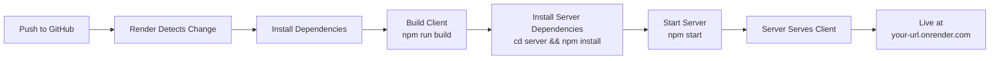
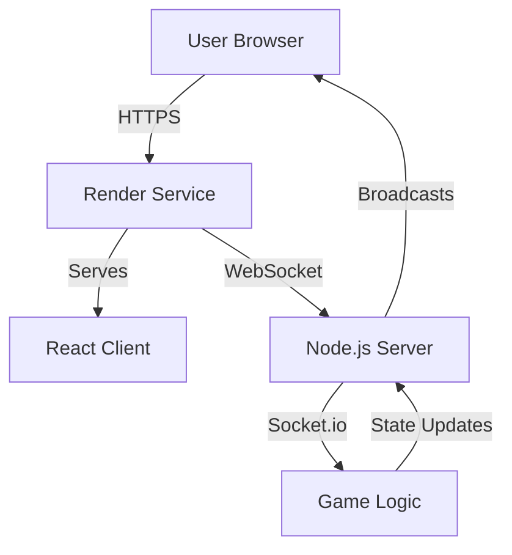

# PokerPov Deployment Guide - Render (All-in-One)

Deploy your entire PokerPov game (client + server) to Render in just a few clicks! 🚀

## ✅ What's Been Set Up

Your project is now configured for **single-service deployment** on Render:

- ✅ **Unified build script** - Builds both client and server
- ✅ **Static file serving** - Server serves the client automatically
- ✅ **Production config** - Environment variables configured
- ✅ **Render config** - `render.yaml` ready for instant deployment
- ✅ **CORS configured** - Works with Render domains

## 🚀 Deploy in 3 Steps

### Step 1: Push to GitHub (if not already)

```bash
cd /Users/sabarnimmagadda/BlockPoker

# Initialize git if needed
git init

# Add all files
git add .

# Commit
git commit -m "Ready for deployment"

# Create a new repo on GitHub, then:
git remote add origin https://github.com/YOUR_USERNAME/pokerpov.git
git branch -M main
git push -u origin main
```

### Step 2: Deploy to Render

#### Option A: Blueprint (Easiest - One Click)

1. Go to https://render.com and sign up
2. Click **"New +"** → **"Blueprint"**
3. Connect your GitHub repo
4. Render reads `render.yaml` and sets everything up automatically
5. Click **"Apply"**
6. Wait 5-10 minutes for build to complete

#### Option B: Manual Setup

1. Go to https://render.com and sign up
2. Click **"New +"** → **"Web Service"**
3. Connect your GitHub repository
4. Configure:
   - **Name**: `pokerpov`
   - **Environment**: Node
   - **Build Command**: `npm install && npm run build:all`
   - **Start Command**: `npm start`
   - **Plan**: Free (or Starter for better performance)
5. Click **"Create Web Service"**

### Step 3: Access Your Game!

Once deployed, Render gives you a URL like:
```
https://pokerpov.onrender.com
```

**That's it!** Your game is live! 🎉

## 📝 Important Notes

### Free Tier Limitations

- ⚠️ **Sleeps after 15 min of inactivity**
- First visit after sleep takes ~30-60 seconds to wake up
- Perfect for testing and demos

### Upgrade to Paid ($7/month)

Benefits:
- ✅ No sleep - instant access
- ✅ Better performance
- ✅ More resources

To upgrade: Dashboard → Your Service → "Upgrade Plan"

## 🔧 Configuration

### Environment Variables on Render

The `render.yaml` sets these automatically:
- `NODE_ENV`: `production`
- `PORT`: `10000`

If you need to add more:
1. Go to your service dashboard
2. Click "Environment"
3. Add variables
4. Service auto-redeploys

### Custom Domain (Optional)

1. Go to your service → "Settings" → "Custom Domains"
2. Add your domain (e.g., `poker.yourdomain.com`)
3. Add CNAME record to your DNS:
   ```
   CNAME poker yourdomain.onrender.com
   ```
4. Wait for DNS propagation (5-30 minutes)

Then update `server/index.ts` CORS:
```typescript
origin: [
  // ... existing origins ...
  'https://poker.yourdomain.com'
],
```

## 🔄 Updating Your Deployment

Render auto-deploys on every push to main:

```bash
# Make your changes
git add .
git commit -m "Update game features"
git push

# Render automatically builds and deploys!
```

## 🐛 Troubleshooting

### Build Failed

**Check the logs:**
1. Dashboard → Your Service → "Logs"
2. Look for error messages

**Common issues:**
- Missing dependencies: Run `npm install` locally first
- TypeScript errors: Fix with `npm run build` locally
- Wrong Node version: Render uses Node 20 by default

### Game Won't Load

**Check:**
1. **Server Status**: Visit `https://your-url.onrender.com/health`
   - Should return: `{"status":"ok","uptime":123}`
2. **Browser Console**: Look for errors
3. **Network Tab**: Check if WebSocket connects

### WebSocket Connection Failed

**Symptoms:** Can't join rooms, multiplayer doesn't work

**Fix:**
1. Check CORS in `server/index.ts` includes Render domain
2. Verify `render.yaml` has correct build commands
3. Check Render logs for errors

### Service Sleeping (Free Tier)

**Symptoms:** Takes forever to load on first visit

**Solutions:**
- Upgrade to paid plan ($7/month)
- Use a cron job to ping your service every 14 minutes:
  - https://cron-job.org
  - Schedule: `*/14 * * * *`
  - URL: `https://your-url.onrender.com/health`

## 📊 Monitoring Your Deployment

### Health Check

Visit: `https://your-url.onrender.com/health`

Response:
```json
{
  "status": "ok",
  "uptime": 12345.67
}
```

### Render Dashboard

Monitor:
- **CPU Usage**
- **Memory Usage**
- **Request Logs**
- **Build History**

Access: Dashboard → Your Service → "Metrics"

### View Logs

Real-time logs:
```bash
# Install Render CLI
npm install -g render-cli

# Login
render login

# View logs
render logs -f
```

Or view in dashboard: Your Service → "Logs"

## 🎮 Testing Your Deployment

1. **Open your Render URL**
2. **Create a room** (you're the host)
3. **Copy the room code**
4. **Open on another device** or browser
5. **Join with the room code**
6. **Play poker!** 🃏

## 💰 Cost Breakdown

### Free Tier
- **Cost**: $0/month
- **Limitations**: 
  - Sleeps after 15 min inactivity
  - 750 hours/month
  - Shared CPU/RAM
- **Good for**: Testing, demos, small games

### Starter Plan
- **Cost**: $7/month
- **Benefits**:
  - No sleep
  - Always-on service
  - Better resources
  - 1 GB RAM
- **Good for**: Production use

## 🎉 You're Live!

Share your game:
```
https://pokerpov.onrender.com
```

## 🆘 Need Help?

1. **Check Render Docs**: https://render.com/docs
2. **Check logs**: Dashboard → Your Service → "Logs"
3. **Render Community**: https://community.render.com

---

## 📚 What Happens During Deployment



## 🏗️ Architecture



**All running on ONE Render service!** 🎯
